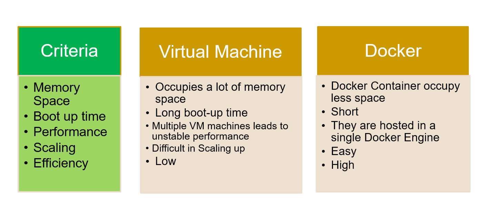

# What is Container?
    - A container is a lightweight package that contains an application's code, libraries,
      configuration files, and dependencies. Containers are a type of virtualization that
      allow applications to be moved between environments while retaining functionality.
      This makes containers a good solution for applications that may fail to run
      correctly when moved from one environment to another.

      A container is a bundle of Application, Application libraries required to run your application and the minimum system dependencies.

# What is Deployment?
    Software deployment is the process of making software available to be used on a system 
    by users and other programs.

# Containers vs Virtual Machine
   Containers and virtual machines are both technologies used to isolate applications and their dependencies, but they have some key differences:
# What are the advantages of Docker over Virtual machines

# Why are containers light weight ?
    Containers are lightweight because they use a technology called containerization, 
    which allows them to share the host operating system's kernel and libraries, while 
    still providing isolation for the application and its dependencies. This results in a 
    smaller footprint compared to traditional virtual machines, as the containers do not 
    need to include a full operating system. Additionally, Docker containers are designed 
    to be minimal, only including what is necessary for the application to run, further 
    reducing their size.

# What is Docker ?
      Docker is a set of platform as a service products that use OS-level virtualization to
      deliver software in packages called containers.
     Containers are isolated from one another and bundle their own software, libraries 
     and configuration files; 
     they can communicate with each other through well-defined channels.

In simple words, you can understand as containerization is a concept or technology and Docker Implements Containerization.

# Docker Architecture ?
   